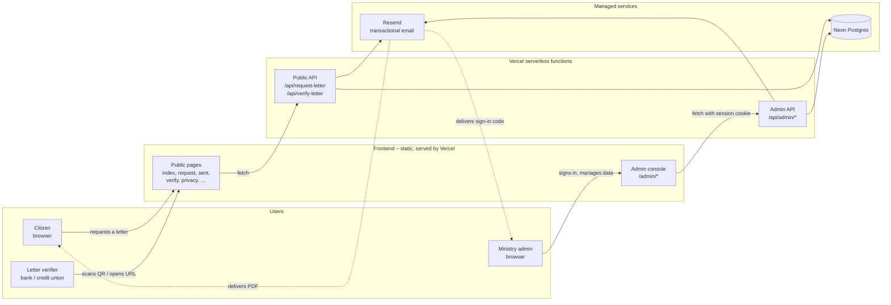
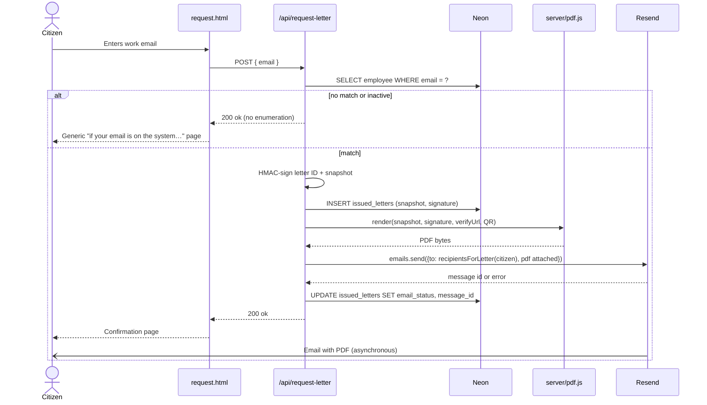
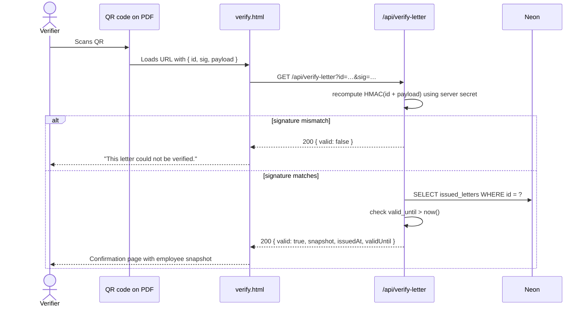
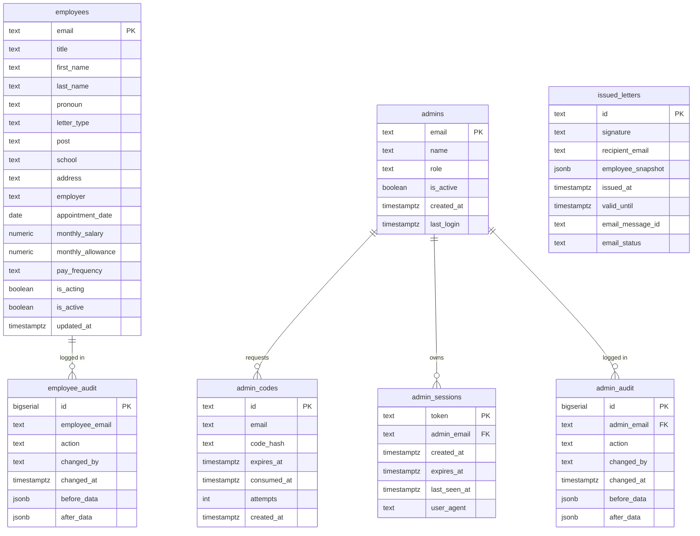
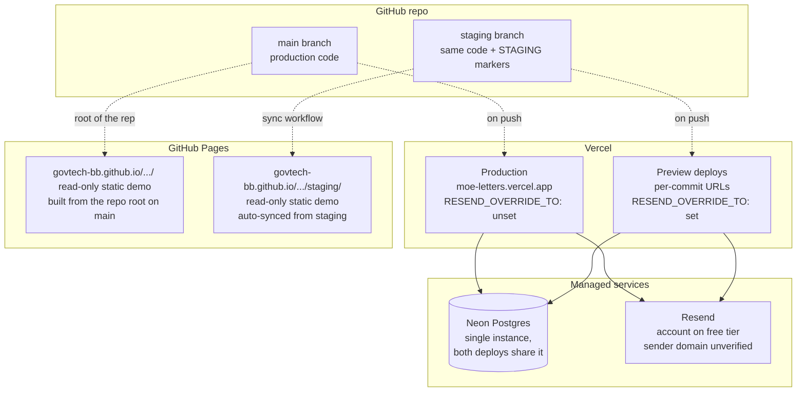

# Architecture

A visual map of the Job Letters service: who interacts with it, how the
pieces talk to each other, what the data looks like, and where the code
runs.

All diagrams use Mermaid; GitHub renders them natively when you view this
file on `github.com`. To edit locally, paste any block into
[mermaid.live](https://mermaid.live).

## At a glance

The system has three external user types, two halves of the frontend
(public + admin), one set of serverless functions, and two managed
services.



## User flow: request a letter

The happy path, end to end. Note the no-enumeration response on
mismatched emails (citizens never learn which addresses are on file),
and the order: persist the snapshot first, then attempt delivery, then
record the delivery outcome.



## Admin sign-in: magic link

Two-step credential flow. The override list (per ADR 0006) means
credential emails reach both the admin and the in-team test inboxes.

```mermaid
sequenceDiagram
  actor A as Admin
  participant L as admin/login.html
  participant API1 as /api/admin/login
  participant API2 as /api/admin/verify
  participant DB as Neon
  participant R as Resend

  A->>L: Enter admin email
  L->>API1: POST { email }
  API1->>DB: SELECT admins WHERE LOWER(email) = ?
  alt not on allowlist
    API1-->>L: 200 ok (no enumeration)
  else on allowlist
    API1->>DB: INSERT admin_codes (sha256 hash, 10-min TTL)
    API1->>R: emails.send(to: recipientsForAdminEmail(admin), body: "code")
    Note over R,A: Admin + override list (deduped, ADR 0006)
    R-)A: 6-digit code via email
    API1-->>L: 200 ok
  end
  A->>L: Enter 6-digit code
  L->>API2: POST { email, code }
  API2->>DB: SELECT latest unconsumed code for email
  API2->>API2: sha256(code) === stored hash?
  API2->>DB: INSERT admin_sessions (random token, 8-hr TTL)
  API2->>DB: UPDATE admin_codes SET consumed_at = NOW()
  API2-->>L: Set-Cookie: moe_admin_session=…; HttpOnly
  L-->>A: Redirect to /admin/
```

## Verification of a letter

The third-party verifier scans the QR and lands on `/verify.html?…`.
Verification is self-contained — no database lookup required to confirm
authenticity, only to check the "valid until" window.



## Data model

Seven tables. The unusual choice is the lack of a foreign key from
`issued_letters` to `employees` — letters carry an immutable JSONB
snapshot of the employee at the moment of issue (ADR 0002).



## Deployment topology

Two branches map to two Vercel deploys and two GitHub Pages URLs. The
red STAGING banner and the "What's new" panel are the only deliberate
code differences between branches.



## Repository layout

```
moe-letters/
├─ User-facing pages (root)
│  ├─ index.html, request.html, sent.html, verify.html
│  ├─ privacy.html, accessibility.html, cookies.html,
│  │  contact.html, terms.html, not-found.html
│  └─ chrome.js · styles.css · page.css
├─ admin/                   ← Admin console (HTML + JS only)
│  ├─ login.html · index.html (dashboard)
│  ├─ letters.html · letter.html
│  ├─ employees.html · employee-edit.html
│  ├─ admins.html · confirm.html
│  └─ admin-chrome.js
├─ api/                     ← Vercel serverless functions
│  ├─ request-letter.js
│  ├─ verify-letter.js
│  └─ admin/{login,verify,logout,me,dashboard,letters,letter,employees,admins}.js
├─ server/                  ← Shared libs (Node, run on Vercel + dev)
│  ├─ index.js              ← Express dev server (mirrors all routes)
│  ├─ pdf.js                ← pdf-lib letter generation
│  ├─ db/schema.sql
│  └─ lib/
│     ├─ db.js              ← Neon driver
│     ├─ adminAuth.js       ← magic-link auth
│     ├─ email.js           ← Resend wrapper, letter delivery
│     ├─ recipients.js      ← RESEND_OVERRIDE_TO routing helpers
│     └─ handlers/{adminEmployees,adminLetters,adminDashboard,adminAdmins}.js
├─ decisions/               ← ADRs (you are here, future-maintainer)
│  └─ 0001…0006-*.md
├─ staging/                 ← /staging/ folder on GitHub Pages
│  └─ auto-synced from the staging branch via Actions
├─ assets/                  ← logos, favicon, fonts
├─ principles/              ← gitignored — personal product/dev principles
└─ ARCHITECTURE.md          ← this file
```

## Key cross-cutting concerns

A few non-obvious choices worth knowing about before reading the code.
Each one has a full ADR if you want the long version.

- **Letters are immutable** ([ADR 0002](decisions/0002-snapshot-employee-data-into-letters.md)) — `issued_letters.employee_snapshot` is the source of truth for that letter forever, regardless of what the live `employees` row says later.
- **Verification needs no database** ([ADR 0003](decisions/0003-hmac-signed-verification-tokens.md)) — the HMAC in the URL is enough to confirm authenticity; the DB is consulted only for "is this still valid."
- **Admin auth has no passwords** ([ADR 0001](decisions/0001-magic-link-admin-auth.md)) — email + 6-digit code + session cookie. No SSO dependency.
- **Override list copies admin emails** ([ADR 0006](decisions/0006-override-list-copies-admin-credential-emails.md)) — `RESEND_OVERRIDE_TO` is a comma-separated list and admin credential emails go to the admin **plus** the list. Must be unset in production.
- **Destructive actions go through `/admin/confirm.html`** ([ADR 0005](decisions/0005-confirmation-pages-for-destructive-actions.md)) — never `window.confirm()`. New destructive actions add a row to the action catalogue, not a new modal.
